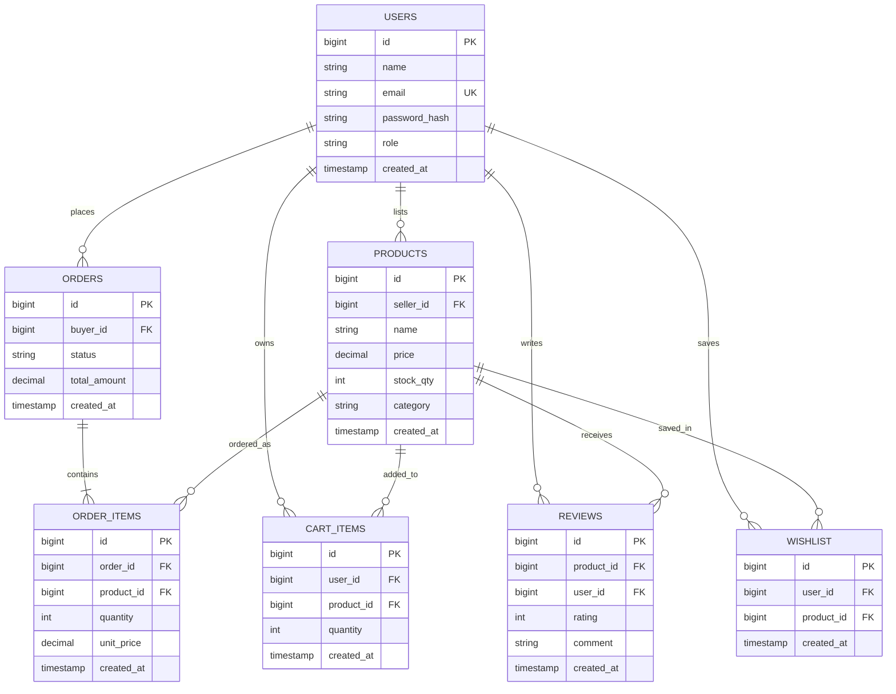

# D1 — Entity relationships

```mermaid
erDiagram
 USERS ||--o{ PRODUCTS : lists
 USERS ||--o{ ORDERS : places
 USERS ||--o{ CART_ITEMS : owns
 USERS ||--o{ REVIEWS : writes
 USERS ||--o{ WISHLIST : saves
 ORDERS ||--|{ ORDER_ITEMS : contains
 PRODUCTS ||--o{ ORDER_ITEMS : ordered_as
 PRODUCTS ||--o{ CART_ITEMS : added_to
 PRODUCTS ||--o{ REVIEWS : receives
 PRODUCTS ||--o{ WISHLIST : saved_in
 USERS { bigint id PK string name string email UK string password_hash string role timestamp created_at }
 PRODUCTS { bigint id PK bigint seller_id FK string name decimal price int stock_qty string category timestamp created_at }
 ORDERS { bigint id PK bigint buyer_id FK string status decimal total_amount timestamp created_at }
 ORDER_ITEMS { bigint id PK bigint order_id FK bigint product_id FK int quantity decimal unit_price timestamp created_at }
 CART_ITEMS { bigint id PK bigint user_id FK bigint product_id FK int quantity timestamp created_at }
 REVIEWS { bigint id PK bigint product_id FK bigint user_id FK int rating string comment timestamp created_at }
 WISHLIST { bigint id PK bigint user_id FK bigint product_id FK timestamp created_at }
```
