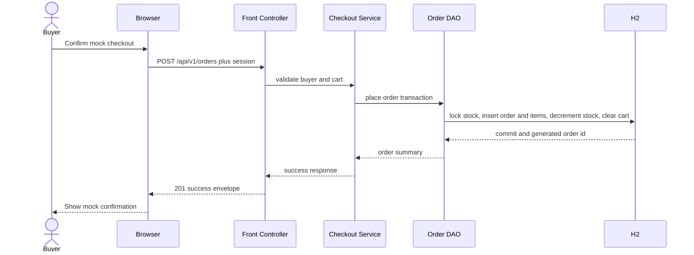

# D3 — Place-order sequence

```mermaid
sequenceDiagram
 actor Buyer
 participant Browser
 participant Servlet as Front Controller
 participant Service as Checkout Service
 participant DAO as Order DAO
 participant DB as H2
 Buyer->>Browser: Confirm mock checkout
 Browser->>Servlet: POST /api/v1/orders plus session
 Servlet->>Service: validate buyer and cart
 Service->>DAO: place order transaction
 DAO->>DB: lock stock, insert order and items, decrement stock, clear cart
 DB-->>DAO: commit and generated order id
 DAO-->>Service: order summary
 Service-->>Servlet: success response
 Servlet-->>Browser: 201 success envelope
 Browser-->>Buyer: Show mock confirmation
```
