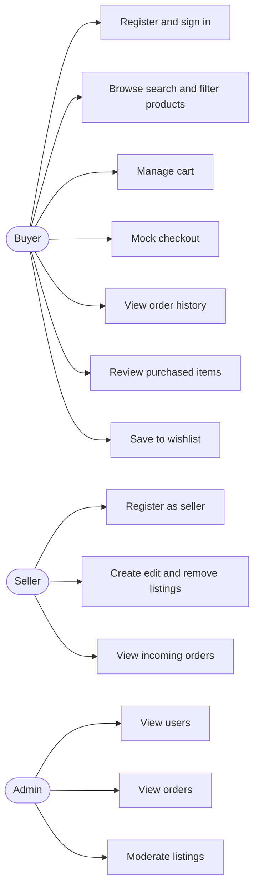

# D2 — Use cases

```mermaid
graph LR
 Buyer([Buyer]) --> Register[Register and sign in]
 Buyer --> Browse[Browse search and filter products]
 Buyer --> Cart[Manage cart]
 Buyer --> Checkout[Mock checkout]
 Buyer --> History[View order history]
 Buyer --> Review[Review purchased items]
 Buyer --> Wish[Save to wishlist]
 Seller([Seller]) --> Join[Register as seller]
 Seller --> Listings[Create edit and remove listings]
 Seller --> Incoming[View incoming orders]
 Admin([Admin]) --> Users[View users]
 Admin --> Orders[View orders]
 Admin --> Moderate[Moderate listings]
```
